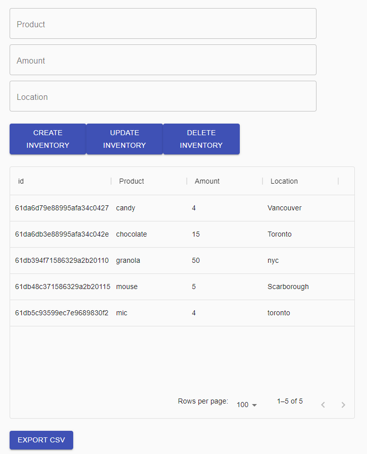
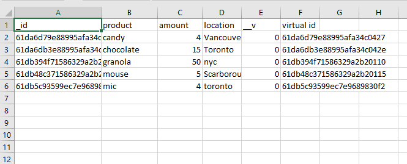

# Shopify Backend Chalenge Summer 2022

Challenge google docs description found here: [Shopify 2022 backend challenge](https://docs.google.com/document/d/1z9LZ_kZBUbg-O2MhZVVSqTmvDko5IJWHtuFmIu_Xg1A/edit#)

This is a inventory tracking CRUD web application built using a MERN tech stack. Inventory items consist of a product, amount, and location. This web application allows the user to create, view, update, and delete inventory items through the UI. 

## Additional Features
Alongside the basic CRUD functionality, the additional feature includes the ability to export and download data to a csv file.

## Instructions to run the app

A prerequisite before you can run this web app, is that Node.js version 16.x is on your machine. 

Once you have Node.js installed on your machine, begin by cloning this repo using the command `https://github.com/yu-jimmy/Shopify-Backend-Challenge.git`. 

In one terminal shell, navigate to the backend folder/directory and run the command `npm install` followed by `npm start`. Then in another terminal shell, navigate to the root directory and again run the command `npm install` followed by`npm start`.

Wait for the frontend to compile and it will launch a new tab in your default browser to the web application, where you can begin using the app.

## API Documentation

### **GET**:
- route: /
- description: Queries the database and retrieves all inventory items
- request: `GET /`
    - content-type: `application/json`
- response: 200
    - content-type: `application/json`
    - body: object
        - data
            - inventory: list of all inventories in the database
- response: 400
    - body: object 
        - data
            - Server cannot perform or process request

 

- route: /download
- description: Queries the database for all inventory items and formats the data to be exported as a CSV
- request: `GET /download`
    - content-type: `application/json`
- response: 200
    - content-type: `application/json`
    - body: object
        - data
            - inventory: list of all inventories in the database
- response: 400
    - body: object 
        - data
            - Server cannot perform or process request

### **POST**:
- route: /create
- description: Creates a new inventory item in the database
- request: `POST /create`
    - content-type: `application/json`
    - body: object
        - product: name of product
        - amount: amount of product
        - location: location of product
- response: 200
    - content-type: `application/json`
    - body: object
        - data
            - Sucessfully added new inventory item
- response: 400
    - body: object 
        - data
            - Server cannot perform or process request

### **PATCH**:
- route: /:product
- description: Updates an inventory item in the database given a product name
- request: `PATCH /:product`
    - content-type: `application/json`
    - body: object
        - product: name of product
- response: 200
    - content-type: `application/json`
    - body: object
        - data
            - Sucessfully updated new inventory item
- response: 404
    - body: object 
        - data
            - Item to delete not found

### **DELETE**:
- route: /:product
- description: Deletes an inventory item in the database given a product name
- request: `DELETE /:product`
    - content-type: `application/json`
    - body: object
        - product: name of product
- response: 200
    - content-type: `application/json`
    - body: object
        - data
            - Sucessfully deleted an inventory item
- response: 404
    - body: object 
        - data
            - Item to delete not found